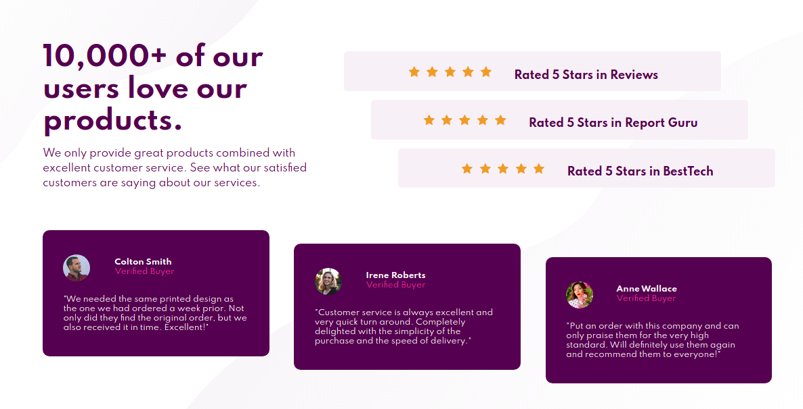

# Frontend Mentor - Social proof section

## Overview

### The challenge

- Build out the project to the designs provided

### Screenshot

### Links

- Live Site URL: [github-pages](https://dehfachini.github.io/social-proof/)

## My process

### Built with

- Semantic HTML5 markup
- CSS custom properties

## Author

- Website - [Débora](https://github.com/dehfachini)
- Frontend Mentor - [@dehfachini](https://www.frontendmentor.io/profile/dehfachini)

